<h3><code>kev@github ~ $ ./contributions.sh</code></h3>

  

<h3><code>kev@github ~ $ whoami</code></h3>

  

<h3><code>kev@github ~ $ cat stack.json</code></h3>

  

<h3><code>kev@github ~ $ ls -la ~/featured</code></h3>

| Project | What I'm building | Stack |
| :-- | :-- | :-- |
| **[Surlap](https://github.com/kev208dev/Surlap)** | Calendar, timetable & home-widget app with NEIS integration, shared calendars and cloud sync | `Flutter` `Dart` `Riverpod` `Supabase` |
| **[Semopyo](https://github.com/kev208dev/Semopyo)** | Spiciness database app with product data and barcode scanning | `Flutter` `Dart` `mobile_scanner` |
| **[SupersonicDRIFT](https://github.com/kev208dev/SupersonicDRIFT)** | 3D racing sandbox with online realtime lap leaderboards · **[Live](https://kev208dev.github.io/SupersonicDRIFT/)** | `JavaScript` `Three.js` `Node.js` `PostgreSQL` |
| **[PageRank Simulator](https://github.com/kev208dev/pagerank-simulator)** | Interactive PageRank + matrix visualization demo with graph editing and step-by-step calculation | `HTML` `JavaScript` `Canvas` |

 

<code>build → ship → learn → iterate</code>

